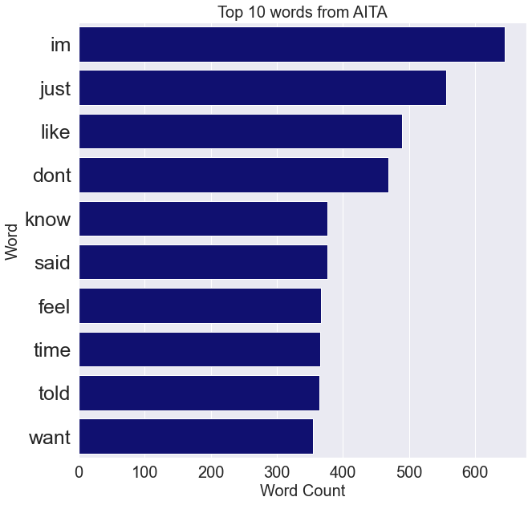
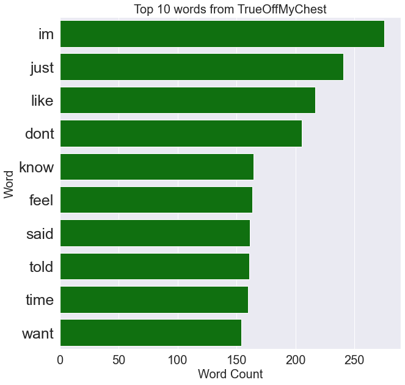
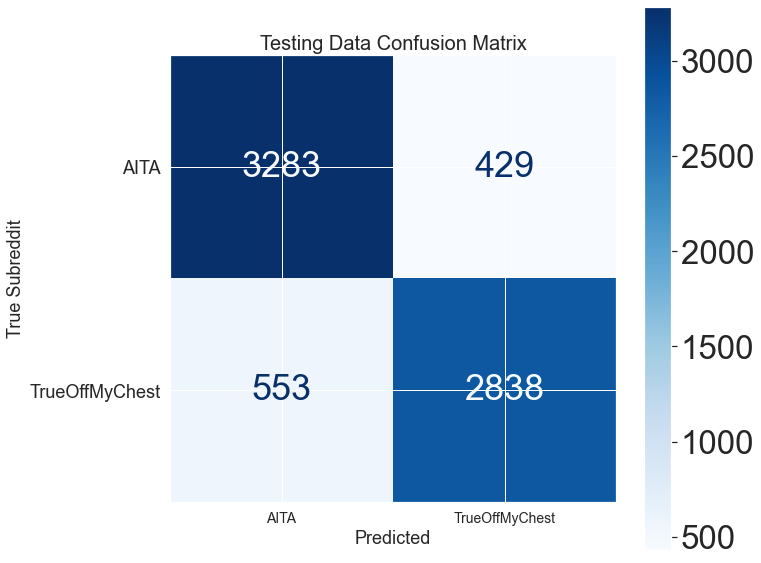

# Natural Language Processing (NLP) Utilizing Reddit

by: Colby Tse

# Table of Contents

- [Problem Statement](#Problem-Statement)
- [Summary of Analysis](#Summary-of-Analysis)
- [File Directory](#File-Directory)
- [Conclusion](#Conclusion)
- [Considerations and Next Steps](#Considerations-and-Next-Steps)

## Problem Statement

Reddit is an online forum that is split into many subforums aptly named subreddits. These many subreddits are managed by their respective communities via moderators and each subreddit has their own rules. Posting to a subreddit is intuitive and easy but a post can often be better suited posted in a different subreddit. I have been tasked with creating a classifier using Natural Language Processing to predict which subreddit a post is better suited for based off of key linguistic trends. For this task, I have chosen r/AmItheAsshole (AITA) and r/TrueOffMyChest (TOMC) due to their similar content. 

Both subreddits contain story driven narratives with the key difference being AITA is often used as a metric for redditors to determine whether or not they were being an asshole given the situation described in their post. As indicated in AITA's about section, people posting to this subreddit have a suspicion they were an asshole in a situation and wish to parse the opinions of other redditors.

Posts in TOMC is often used by redditors to tell a narrative where they don't necessarily believe they were being an asshole but have an opinion or situation they feel a strong desire to share. These two subreddits have similar content with the caveat of AITA posts having a predisposition from authors believing they may have been an asshole. Thus it is with these two subreddits I will create an NLP classification model to determine if linguistic trends in AITA vs. TOMC posts can identify and predict which subreddit an author should post in and, by extension, if the author is an asshole.

## Summary of Analysis

PushShift API was used to scrape data from both subreddits for this exploratory data analysis. At the time of project execution, PushShift was undergoing a migration and I was unable to parse more than a month or two of posts from any single subreddit. Shortly after scraping, the API underwent additional changes and I have been unable to parse it since. In total, 30,995 posts from AITA and 17,537 posts from TOMC were scraped for use. Entries where the body of the post was either '[removed]' or '[deleted]' by the author were dropped from the dataset. After cleaning the post body and titles, both these columns were combined into a singular column containing all text used in my NLP classification. 

The text was scrubbed of common English words via the *stop_words* parameter in the vectorizer and other text was manually removed in the data cleaning process. Problematic acroyms like "AITA", "WIBTA", and "WIBTAH" were removed since they almost exclusively appeared in the AITA subreddit and would skew the model. Other words were considered for removal such as the top 10 words appearing in both subreddits due to them being identical discount frequency. Random Forest classification and Extra Trees was also used, however offered poorer performance when compared to the logistic regression models. Random Forest had a high overall score than Logistic Regression but also had a disproportionate high bias towards AITA predictions.

#### Post Details
Avg. 1,724 Words per Post| Avg. 1,630 Words per Post
:---:|:---:
  |  

As illustrated in the tables above, the most prevalent words used in both subreddits are identical. When removing these top terms, however, I saw a minor loss in overall accuracy for the testing data but identical accuracy for the training set. This is likely due to how my model utilizes word frequency as a metric in determining classification. Looking at the count of each word we see AITA has a much higher frequency of use but looking a little further we find AITA and TOMC have similar average word count per post with AITA having a little less than 100 more words per post. 

For this analysis Count Vectorizer and TF-IDF Vectorization was used in conjunction with Logistic Regression. Grid Search CV was utilized to find optimal settings for both vectorizers and regressors. Ultimately the final model uses TF-IDF Vectorization due to a slightly better performance on the test data score and less overfit training score. 

## File Directory

|File|Description|
|---|---|
|subreddits.csv|Web scrapped data from r/AmItheAsshole and r/TrueOffMyChest|
|cleaned_data.csv|subreddits.csv dataframe cleaned with all features intact|
|cleaned_selective_data.csv|Data chosen for EDA with selected features: Subreddit, Score, Self Text, Title, Author, Date Created|

## Conclusion

My final model uses TF-IDF Vectorization and Logistic Regression with an accuracy of 91.7% on the training set and a 87.4% on the test set. The baseline score was 52.25%. The model is overfit most likely due to the nature of the language used in both these subreddits being quite similar and I had slightly more data for AITA  As illustrated in the confusion matrix below, a majority of the predicted values aligns with the true values. Based on this input, I can say with fair confidence the model I created is able to predict which of these two subreddits a post should belong to. 

## Considerations and Next Steps

In the interest of resources and time, I had to stop my exploration here. With additional resources, I would like to explore sentiment analysis of the langage used in each subreddit. In story driven narratives like the posts of AITA and TOMC, emotional weight should have a measurable impact on NLP classification and modeling. Sentiment analysis using tools like Pattern, VADER, or Bert should give greater insight to the type of language used in these subreddits. Of course there are many other tools available for use, but I'd like to focus on one or two at a time. By focusing on one or two at a time, I can give myself a fair chance to learn the caveats of each tool in order to properly execute each one. 

Expanding further beyond simply AITA or TOMC, I'd like to incoporate posts from other subreddits and increase the complexity of the models. With additional data from other subreddits like r/Science, could I parse the model with technical jargon and still have it perform just as well or better? To really push the model, I'd like to include data from another forum of similar content or structure to test whether Reddit tends to attract a certain type of person or if Reddit is a good litmus of the more general population. 

Given the context of r/AmItheAsshole could I use these classification models to parse what we, as a society, colloqually accept as an *a-hole*? Using text written by someone, could the models suss out what an *a-hole* is?